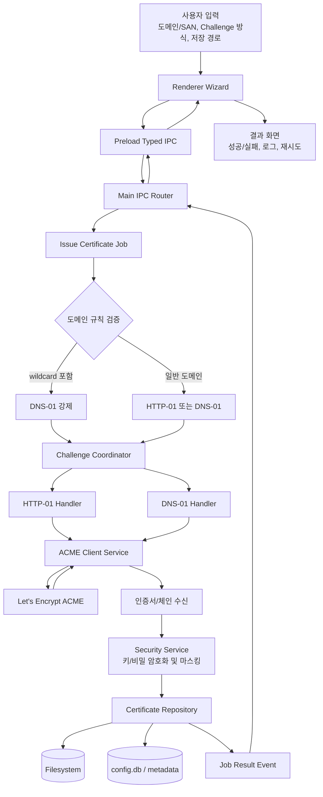

# 데이터 흐름도 (도메인 입력 → ACME 발급 → 결과 저장)

## 레벨 0 흐름

## 레벨 1 상세 단계
1. 사용자 입력 수집
   - 도메인, SAN, challenge 선호, 저장경로, 환경(스테이징/프로덕션)
2. 입력 검증
   - FQDN 형식 검사, 중복 도메인 제거, wildcard 포함 여부 판별
3. 발급 작업 생성
   - Job ID 발급, 진행 상태 이벤트 스트림 시작
4. ACME 계정 준비
   - 계정키 생성/로딩, 계정 등록(필요 시)
5. Order 생성 및 Authorization 수신
6. Challenge 수행
   - HTTP-01: 파일 배치→외부 접근 확인→ready
   - DNS-01: TXT 등록→전파 확인→ready
7. 검증 완료 후 Finalize
   - CSR 생성, Finalize 호출, cert chain 다운로드
8. 결과 저장
   - 인증서/키 저장, 메타데이터 저장, 로그 기록(마스킹)
9. UI 반영
   - 성공 시 목록 갱신, 실패 시 단계/원인/재시도 가이드 표시

## 상태 전이(요약)
- `DRAFT` → `VALIDATING_INPUT` → `ACCOUNT_READY` → `ORDER_CREATED`
- `CHALLENGE_PENDING` → `CHALLENGE_VALID` → `FINALIZING`
- `ISSUED` 또는 `FAILED`

## 실패 지점 및 복구
- 입력 오류: 즉시 사용자 교정 요청
- HTTP 접근 실패: URL/응답코드 진단 제공 후 재시도
- DNS 전파 지연: 대기/재조회 옵션 제공
- ACME rate limit: 쿨다운 안내 및 스테이징 권고
