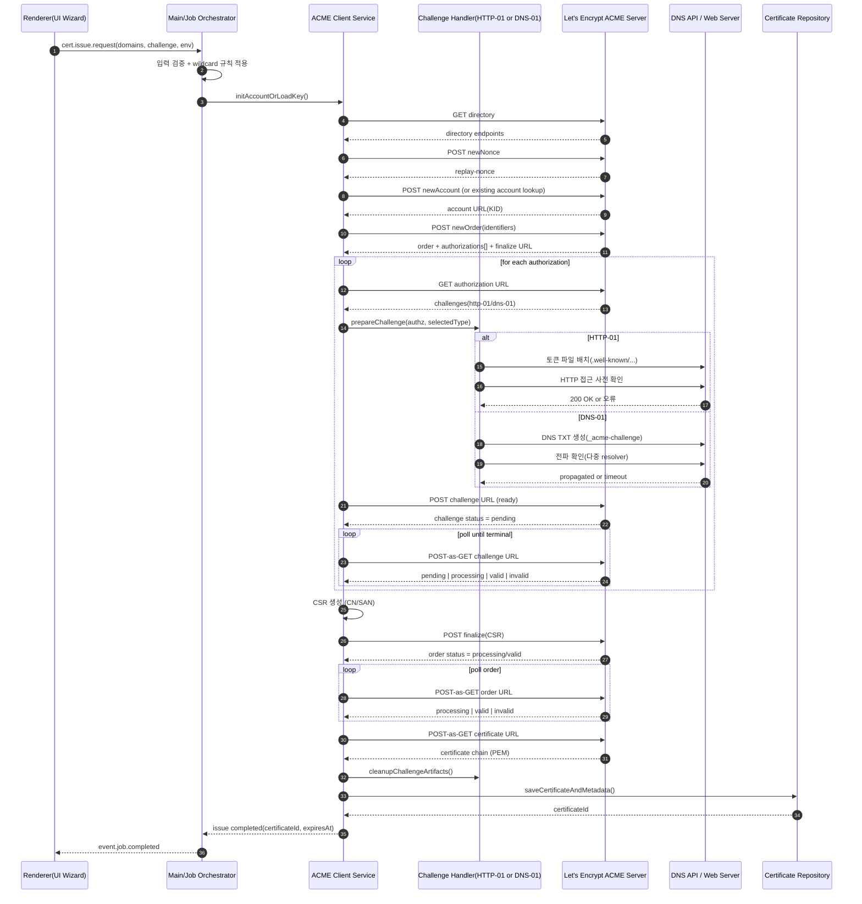

# 시퀀스 다이어그램 (ACME API 호출 순서)

아래 다이어그램은 도메인 입력 이후 ACME 발급이 완료될 때까지의 표준 호출 순서를 표현한다.

## 구현 메모
- wildcard 도메인 포함 시 challenge 선택은 DNS-01로 강제.
- challenge polling과 order polling은 백오프(예: 2s, 4s, 8s) 적용.
- `invalid` 수신 시 즉시 원인 분류(HTTP 접근 실패, DNS 전파 실패, rate limit 등).
