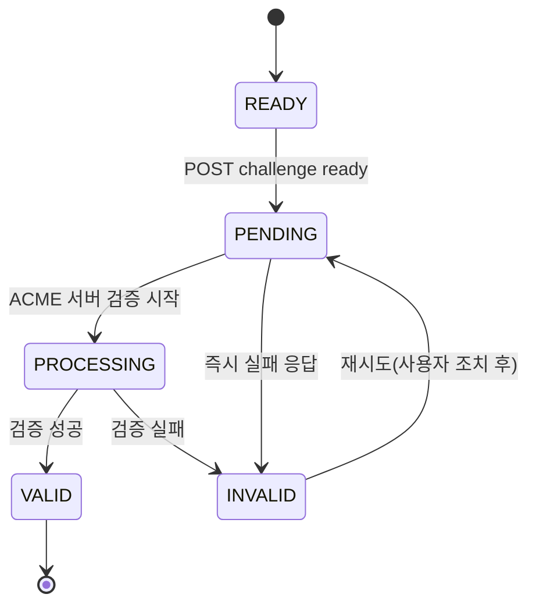
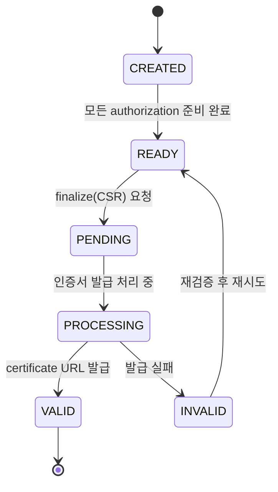

# 상태 전이도 (READY → PENDING → VALID/INVALID)

## 1) Challenge 상태 전이

### 상태 정의
- `READY`: 로컬 준비 완료 상태(HTTP 파일 배치 또는 DNS TXT 등록/전파 확인 완료)
- `PENDING`: ACME 서버에 ready 통지 후 검증 대기 상태
- `PROCESSING`: ACME 서버 측 실제 검증 수행 중
- `VALID`: challenge 검증 성공 (해당 authorization 통과)
- `INVALID`: challenge 검증 실패 (원인 분석 및 재시도 필요)

---

## 2) Order 상태 전이

### 상태 정의
- `CREATED`: `newOrder` 생성 직후
- `READY`: 모든 도메인 authorization이 `valid` 또는 finalize 가능 조건 충족
- `PENDING`: finalize 요청 수락 후 처리 대기
- `PROCESSING`: ACME CA가 인증서 서명/발급 수행 중
- `VALID`: 인증서 다운로드 가능 상태
- `INVALID`: order 무효(일부 도메인 실패, 정책 위반 등)

---

## 3) 앱 내부 상태 매핑 (권장)

| 앱 내부 상태 | Challenge/Order 상태 매핑 | 사용자 표시 |
|---|---|---|
| `CHALLENGE_PENDING` | READY/PENDING/PROCESSING | "도메인 검증 진행 중" |
| `CHALLENGE_VALID` | VALID | "도메인 검증 완료" |
| `FINALIZING` | READY→PENDING→PROCESSING | "인증서 발급 처리 중" |
| `ISSUED` | VALID | "발급 완료" |
| `FAILED` | INVALID | "발급 실패(원인 확인 필요)" |

## 4) 실패 처리 규칙
- `INVALID` 진입 시 실패 객체(problem detail) 저장 후 UI에 원인/조치 가이드 표시.
- 재시도 가능 오류(`retryable=true`)는 동일 `jobId` 내 단계 재개를 허용.
- 재시도 불가 오류(계정 문제, 정책 위반)는 새 작업 생성 유도.
