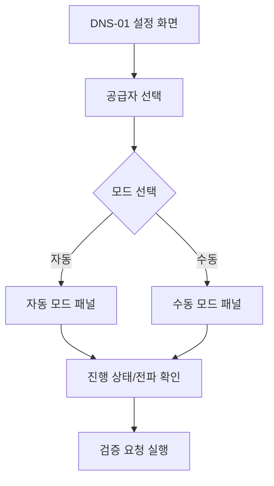

# DNS 수동/자동 모드 화면 구성도

## 1) 화면 구조 개요

---

## 2) 공통 영역
- 상단: 도메인/SAN 요약
- 규칙 배지: "wildcard 포함: DNS-01 필수"
- 환경 선택: staging / production
- 도움말 링크: "DNS TXT 레코드란?", "전파 지연 대응 방법"

---

## 3) 자동 모드 패널

### 입력 영역
- `공급자`: Cloudflare / Route53 / Azure DNS / 기타
- `인증 정보`: API 토큰(저장 참조키로 보관)
- `Zone 자동 감지`: ON/OFF
- `TTL`: 기본 60~120초 권장
- `전파 대기 시간`: 기본 120초 (고급에서 조정)

### 상태 영역
- `TXT 등록됨`
- `전파 확인 중`
- `전파 확인 완료`
- `검증 요청 준비`

### 액션 버튼
- `자동 등록 시작`
- `전파 재확인`
- `TXT 정리`
- `검증 요청 진행`

---

## 4) 수동 모드 패널

### 안내 정보
- 레코드 이름: `_acme-challenge.<domain>`
- 레코드 타입: `TXT`
- 레코드 값: `<acme-token-value>`
- 권장 TTL: `60`

### 체크리스트
- "DNS 관리 콘솔에 TXT 레코드를 추가했습니다."
- "값이 정확히 일치합니다(따옴표/공백 확인)."
- "권한 있는 NS에서 조회됩니다."

### 진단 도구
- `DNS 조회 실행` (A/AAAA 혼동 방지 안내 포함)
- `권한 NS 조회`
- `다중 Resolver 조회 결과`

### 액션 버튼
- `값 복사`
- `레코드 이름 복사`
- `전파 확인`
- `검증 요청 진행`

---

## 5) 오류/피드백 UI 원칙
- 오류는 기술 원인 + 사용자 액션을 함께 제시
  - 예: "전파 지연으로 아직 조회되지 않습니다. 60초 후 재확인하세요."
- 재시도 가능 오류는 강조 표시(`재시도 가능` 배지)
- provider API 오류는 민감정보를 제거한 요약만 표시
