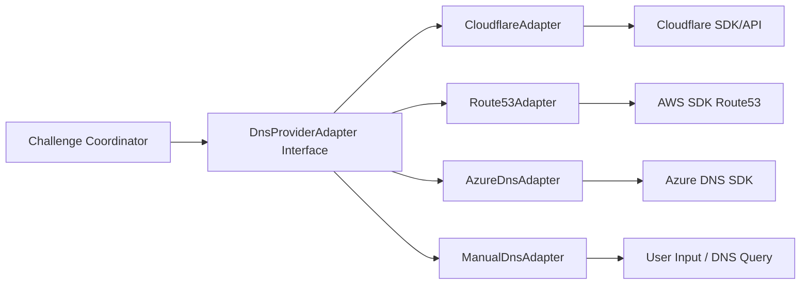

# DNS Provider SDK 어댑터 계층 설계

## 1) 설계 목표
- 공급자별 API 차이를 표준 인터페이스로 추상화
- ACME DNS-01 검증에 필요한 최소 기능(create/wait/delete) 공통화
- 신규 공급자 추가 시 Core 로직 수정 최소화

## 2) 계층 구조



## 3) 공통 인터페이스(초안)

```ts
interface DnsProviderAdapter {
  providerId: string;
  createTxtRecord(input: {
    fqdn: string;          // _acme-challenge.example.com
    value: string;         // ACME TXT value
    ttl?: number;
    context?: Record<string, unknown>;
  }): Promise<{ recordRef: string }>;

  waitForPropagation(input: {
    fqdn: string;
    expectedValue: string;
    timeoutSec: number;
    intervalSec: number;
    resolvers?: string[];
  }): Promise<{ propagated: boolean; observedBy: string[] }>;

  deleteTxtRecord(input: {
    recordRef?: string;
    fqdn: string;
    value: string;
  }): Promise<void>;
}
```

## 4) 에러 표준화
- `DNS_AUTH_FAILED`
- `DNS_ZONE_NOT_FOUND`
- `DNS_RECORD_CONFLICT`
- `DNS_PROPAGATION_TIMEOUT`
- `DNS_RATE_LIMITED`

에러는 provider 고유 오류를 `code/message/retryable/details` 형태로 매핑한다.

## 5) 운영 정책
- `createTxtRecord` 성공 시 `recordRef`를 저장해 cleanup 신뢰성 확보
- propagation 확인은 다중 resolver 기준(공용 + 시스템 resolver)
- timeout 시 즉시 실패하지 않고 사용자에게 수동 검증 옵션 제공
- wildcard + non-wildcard 혼합 SAN에서도 단일 DNS-01 전략 유지
